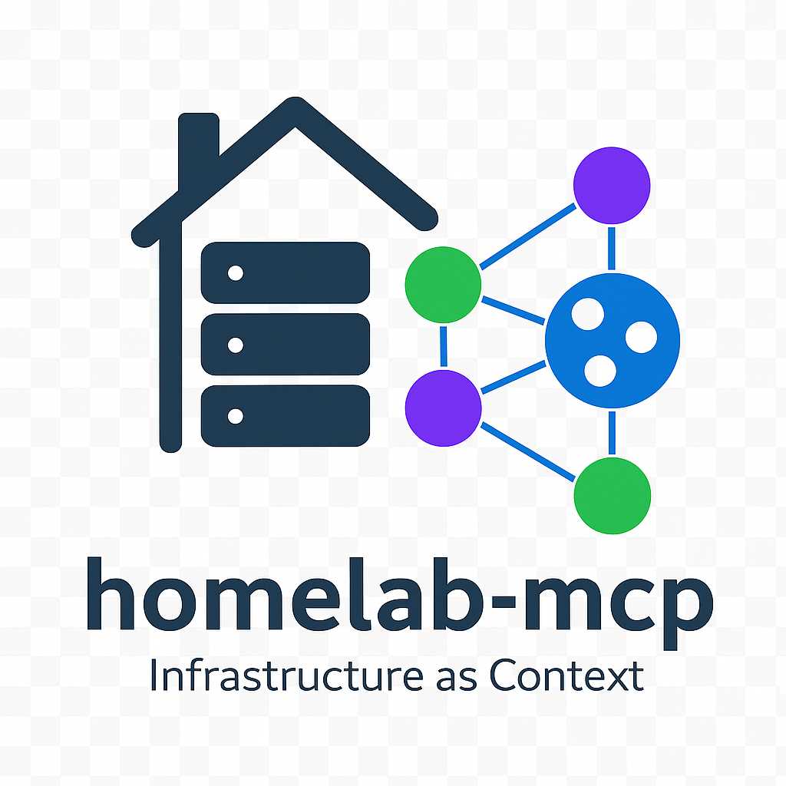

# Homelab MCP Servers

<p align="center">
  
</p>

[](https://github.com/bjeans/homelab-mcp/releases)
[](https://github.com/bjeans/homelab-mcp/actions/workflows/security-check.yml)
[](https://github.com/bjeans/homelab-mcp/actions/workflows/docker-publish.yml)
[](https://hub.docker.com/r/bjeans/homelab-mcp)
[](https://hub.docker.com/r/bjeans/homelab-mcp)
[](https://github.com/bjeans/homelab-mcp/blob/main/LICENSE)


**Monitor and manage your homelab infrastructure through Claude Desktop using Model Context Protocol (MCP) servers.**

7 specialized MCP servers for Docker/Podman containers, Ollama AI models, Pi-hole DNS, Unifi networks, UPS monitoring, Ansible inventory, and network connectivity testing.

---

## 🚀 Quick Start

### 1. Choose Your Deployment

**Option A: Docker (Recommended for Production)**
```bash
docker pull bjeans/homelab-mcp:latest
docker run -d --name homelab-mcp --network host \
  -v $(pwd)/ansible_hosts.yml:/config/ansible_hosts.yml:ro \
  bjeans/homelab-mcp:latest
```

**Option B: Native Python**
```bash
git clone https://github.com/bjeans/homelab-mcp
cd homelab-mcp
pip install -r requirements.txt
cp .env.example .env  # Edit with your configuration
```

### 2. Configure Claude Desktop

Edit your Claude Desktop config:
- **Windows**: `%APPDATA%\Claude\claude_desktop_config.json`
- **macOS**: `~/Library/Application Support/Claude/claude_desktop_config.json`
- **Linux**: `~/.config/Claude/claude_desktop_config.json`

**For Docker:**
```json
{
  "mcpServers": {
    "homelab-unified": {
      "command": "docker",
      "args": ["exec", "-i", "homelab-mcp", "python", "homelab_unified_mcp.py"]
    }
  }
}
```

**For Native Python:**
```json
{
  "mcpServers": {
    "homelab-unified": {
      "command": "python",
      "args": ["C:\\Path\\To\\homelab-mcp\\homelab_unified_mcp.py"]
    }
  }
}
```

### 3. Restart Claude Desktop

That's it! Ask Claude: "What homelab tools are available?"

---

## 📦 Available MCP Servers

### Docker/Podman Container Manager
Monitor containers across multiple hosts with real-time stats.
- **Tools**: `docker_get_containers`, `docker_get_all_containers`, `docker_get_container_stats`, `docker_check_container`
- **Example**: "Show me all running containers across my homelab"

### Ollama AI Model Manager
Track Ollama instances and LiteLLM proxy status.
- **Tools**: `ollama_get_status`, `ollama_get_models`, `litellm_get_status`
- **Example**: "Which Ollama models are available on server1?"

### Pi-hole DNS Manager
Monitor DNS statistics and blocking effectiveness.
- **Tools**: `pihole_get_stats`, `pihole_get_status`
- **Example**: "Get Pi-hole DNS statistics for all instances"

### Unifi Network Monitor
View network devices, clients, and infrastructure health.
- **Tools**: `unifi_get_network_devices`, `unifi_get_network_clients`, `unifi_get_network_summary`
- **Example**: "Show me all network devices and their status"

### UPS Monitoring (NUT)
Monitor UPS devices for power status, battery health, and runtime.
- **Tools**: `ups_get_status`, `ups_get_details`, `ups_get_battery_runtime`, `ups_get_power_events`
- **Example**: "What's the battery status of all UPS devices?"
- **Status codes**: `OL` (online), `OB` (on battery), `LB` (low battery), `CHRG` (charging)

### Ansible Inventory Inspector
Query infrastructure inventory for hosts, groups, and configurations.
- **Tools**: `ansible_get_all_hosts`, `ansible_get_all_groups`, `ansible_search_hosts`
- **Example**: "Show me all hosts in the docker_hosts group"

### Ping Network Connectivity
Test ICMP connectivity to verify host availability.
- **Tools**: `ping_ping_host`, `ping_ping_group`, `ping_ping_all`
- **Example**: "Ping all hosts in the webservers group"

**Dynamic Tool Parameters (v2.1.0+):** When configured with Ansible inventory, Claude shows your actual infrastructure in dropdown menus. Set `ANSIBLE_INVENTORY_PATH` in `.env` and restart Claude Desktop.

---

## ⚙️ Configuration

### Using Ansible Inventory (Recommended)

Create `ansible_hosts.yml` from the example:
```bash
cp ansible_hosts.example.yml ansible_hosts.yml
# Edit with your infrastructure details
```

Example structure:
```yaml
docker_hosts:
  server1:
    ansible_host: 192.168.1.100
    docker_port: 2375

ollama_servers:
  server1:
    ansible_host: 192.168.1.100
    ollama_port: 11434
```

Set in `.env`:
```bash
ANSIBLE_INVENTORY_PATH=/path/to/ansible_hosts.yml
```

### Using Environment Variables

Alternative to Ansible inventory - configure in `.env`:
```bash
# Docker
DOCKER_SERVER1_ENDPOINT=192.168.1.100:2375
DOCKER_SERVER2_ENDPOINT=192.168.1.101:2375

# Ollama
OLLAMA_SERVER1_ENDPOINT=192.168.1.100:11434

# Pi-hole (requires API keys)
PIHOLE_SERVER1_HOST=192.168.1.10
PIHOLE_API_KEY_SERVER1=your-api-key
```

See `.env.example` for all available options.

### Project Instructions for Claude

Create personalized context for Claude:
```bash
cp PROJECT_INSTRUCTIONS.example.md PROJECT_INSTRUCTIONS.md
# Edit with your actual infrastructure details
```

Paste contents into Claude Desktop project instructions. This gives Claude comprehensive context about your specific homelab setup.

---

## 🔒 Security

**⚠️ CRITICAL:** This project interacts with infrastructure APIs. Read [SECURITY.md](SECURITY.md) before deployment.

**Key requirements:**
- Never expose Docker/Podman APIs to the internet
- Keep `.env` file secure (never commit to git)
- Use unique API keys for each service
- Configure firewall rules to restrict API access
- Review network security and VLAN segmentation

**Automated security validation:**
```bash
# Install pre-push hook (recommended)
python helpers/install_git_hook.py

# Manual security check
python helpers/pre_publish_check.py
```

See [SECURITY.md](SECURITY.md) for comprehensive security guidelines.

---

## 🐳 Docker Deployment

**Pre-built images:** https://hub.docker.com/r/bjeans/homelab-mcp

**Quick Start:**
```bash
# Using Docker Compose (recommended)
docker-compose up -d

# Or run directly
docker run -d --name homelab-mcp --network host \
  -v $(pwd)/ansible_hosts.yml:/config/ansible_hosts.yml:ro \
  bjeans/homelab-mcp:latest
```

**Available tags:**
- `latest` - Latest stable release (recommended)
- `edge` - Latest development build
- `2.2.1`, `2.2`, `2` - Semantic version tags

**Multi-platform support:** `linux/amd64`, `linux/arm64`

**See [DOCKER.md](DOCKER.md) for comprehensive Docker deployment guide.**

---

## 🐛 Troubleshooting

### MCP Servers Not Appearing

**Check Claude Desktop config path:**
```bash
# Windows
type %APPDATA%\Claude\claude_desktop_config.json

# Mac/Linux
cat ~/.config/Claude/claude_desktop_config.json
```

**Verify paths are correct and restart Claude Desktop completely.**

### Connection Errors

**Docker/Podman API:**
```bash
curl http://your-host:2375/containers/json  # Test connectivity
netstat -an | grep 2375  # Check if API is listening
```

**Pi-hole API:**
```bash
curl "http://pihole:80/admin/api.php?summary&auth=YOUR_API_KEY"
```

**Ollama:**
```bash
curl http://ollama-host:11434/api/tags
```

**NUT (UPS):**
```bash
telnet nut-server 3493
> LIST UPS
```

### Authentication Errors (401/403)

**Error format (v2.2.0+):**
```
✗ [Service] Authentication Failed (401)

Invalid API key for [hostname]

→ Verify [ENV_VAR] in .env matches service admin panel
→ Generate new key at: [Service Settings Path]
```

**Solutions:**
1. Verify API key in `.env` matches service admin panel
2. For Pi-hole: Settings → API → Show API token
3. For Unifi: Settings → Admins → API → Generate key
4. Restart Claude Desktop after updating `.env`

### Import Errors

```bash
# Reinstall dependencies
pip install --upgrade -r requirements.txt

# Verify MCP installation
pip show mcp
```

### Permission Denied (Linux/Mac)

```bash
chmod 600 .env  # Secure .env file
chmod 644 ansible_hosts.yml  # Make inventory readable
```

**For more troubleshooting:** See [GitHub Discussions](https://github.com/bjeans/homelab-mcp/discussions)

---

## 💻 Development

**For AI assistants & contributors:** Read [CLAUDE.md](CLAUDE.md) for complete development patterns, architecture, and security requirements.

### Getting Started

```bash
# Install security hook (required for contributors)
python helpers/install_git_hook.py

# Install dependencies
pip install -r requirements.txt

# Set up configuration
cp .env.example .env
```

### Testing MCP Servers Locally

Use MCP Inspector for interactive testing:
```bash
# Option 1: Use npx (no installation)
npx @modelcontextprotocol/inspector uv --directory . run docker_mcp_podman.py

# Option 2: Install globally
npm install -g @modelcontextprotocol/inspector
mcp-inspector uv --directory . run docker_mcp_podman.py
```

Opens web debugger at `http://localhost:5173` for testing tools.

### Running Checks

```bash
# Security validation
python helpers/pre_publish_check.py

# All development checks
python helpers/run_checks.py
```

See [CONTRIBUTING.md](CONTRIBUTING.md) for contribution guidelines and [CI_CD_CHECKS.md](CI_CD_CHECKS.md) for testing details.

---

## 📋 Requirements

- **Python**: 3.10+
- **Claude Desktop**: Latest version
- **Network Access**: Connectivity to homelab services

**Service Requirements:**
- Docker/Podman: API enabled on monitored hosts
- Pi-hole: v6+ with API enabled
- Unifi Controller: API access enabled
- Ollama: Running instances with accessible API
- NUT: Installed on hosts with UPS devices
- Ansible: Inventory file (optional but recommended)

**Install dependencies:**
```bash
pip install -r requirements.txt
```

---

## 🤝 Contributing

Contributions welcome! Please:
1. Read [CONTRIBUTING.md](CONTRIBUTING.md) and [SECURITY.md](SECURITY.md)
2. Install pre-push hook: `python helpers/install_git_hook.py`
3. Never commit sensitive data (hook will block automatically)
4. Test thoroughly with real infrastructure
5. Update documentation for changes

**For maintainers:** See [MAINTAINERS.md](MAINTAINERS.md) for release processes and Docker Hub management.

**Pull Request Process:**
1. Fork the repository
2. Create feature branch: `git checkout -b feature/amazing-feature`
3. Make changes and test
4. Run security check: `python helpers/pre_publish_check.py`
5. Commit: `git commit -m 'Add amazing feature'`
6. Push: `git push origin feature/amazing-feature`
7. Open Pull Request

---

## 📚 Documentation

- **[README.md](README.md)** - This file (installation & usage)
- **[DOCKER.md](DOCKER.md)** - Comprehensive Docker deployment guide
- **[SECURITY.md](SECURITY.md)** - Security policies and best practices
- **[CONTRIBUTING.md](CONTRIBUTING.md)** - Contribution guidelines
- **[MAINTAINERS.md](MAINTAINERS.md)** - Maintainer guide (release process)
- **[CLAUDE.md](CLAUDE.md)** - Developer guide for AI assistants
- **[CHANGELOG.md](CHANGELOG.md)** - Version history
- **[CI_CD_CHECKS.md](CI_CD_CHECKS.md)** - Automated testing guide

---

## 🔗 Links

- **Repository**: https://github.com/bjeans/homelab-mcp
- **Docker Hub**: https://hub.docker.com/r/bjeans/homelab-mcp
- **Issues**: https://github.com/bjeans/homelab-mcp/issues
- **Discussions**: https://github.com/bjeans/homelab-mcp/discussions
- **Security**: https://github.com/bjeans/homelab-mcp/security/advisories

---

## 📄 License

MIT License - See [LICENSE](LICENSE) file for details.

Copyright (c) 2025 Barnaby Jeans

---

**Version:** 2.2.1 | **Released:** 2026-01-07 | **Security is paramount - always prioritize security when managing critical infrastructure!**
